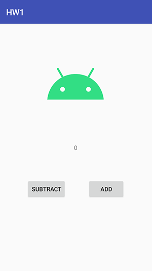

# Homework 1

**INIT:**
```
cp git/hooks/pre-commit .git/hooks/pre-commit
chmod +x .git/hooks/pre-commit
```

1. Follow instructions in [wiki](https://gitlab.fi.muni.cz/grp-pv256/wiki/wikis/home)
and proceed with forking this repo



2. Create layout in 'activity_main.xml' based on the image above
3. Localise button texts (EN + language of your choice)
4. Implement logic for buttons, to decrement/increment value of the TextView above them
5. For the android logo, use the asset in /img directory
6. Submit changes into a **submit** branch and push it to your forked repo
7. Create a merge request against _your_ master branch and assign it to _xsevci11_

Your commit must pass Gitlab CI verification. To test this locally, run:
```
./gradlew check
```
If you followed init instructions, this should be done automatically.
